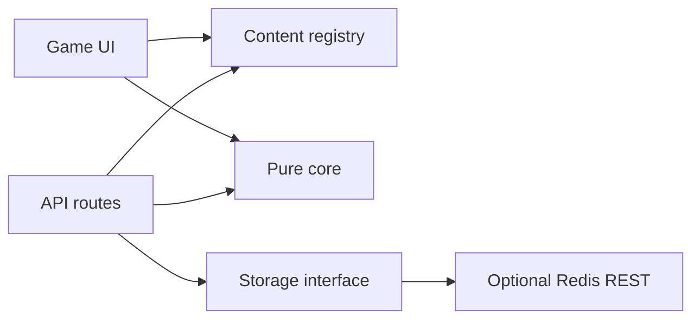

# Architecture

Color Memory Engine stays a single Next.js application in v0.1.0. The extension boundary is a TypeScript contract, not a separately published package.



## Ownership rules

- `src/lib/core` contains pure color, scoring, seed, round, and challenge logic. It does not read environment variables, Redis, HTTP requests, or component state.
- `src/lib/content` owns pack definitions, registration, target resolution, and build-time validation.
- `src/lib/storage` owns Redis keys, TTLs, idempotency, rate limits, and storage error semantics.
- API routes bound request size and shape, call services, and translate results to HTTP.
- UI components can preview target colors, but submitted scores and target colors are never authoritative.

## Daily round contract

The sequence seed is:

```text
gameId:dailySeedNamespace:UTC-date:sessionSeed
```

FNV-1a produces a 32-bit seed, a small linear congruential generator produces repeatable values, and Fisher-Yates shuffles registered targets. The same implementation is imported on both server and client boundaries.

## Score contract

Colors are converted from sRGB to CIE Lab using a D65 reference white. CIEDE2000 calculates perceptual difference, then the default game score maps the difference to 0–10:

```text
score = clamp(10 - deltaE00 * 0.2 - hintPenalty, 0, 10)
```

The implementation is regression-tested against published numerical reference pairs. Applications can change the score mapping, but should retain the underlying difference tests.

## Trust boundary

Leaderboard clients send only `packId`, `targetId`, `guessHex`, and `hintUsed` for each expected round. The service recreates the daily sequence, resolves target colors from the registry, recalculates every score, generates an HMAC fingerprint for idempotency, and then persists.

Redis errors return 503. Rate limits return 429. Invalid inputs or sequence mismatches return 400. A missing production signing secret is a configuration error, not a reason to use a default.
